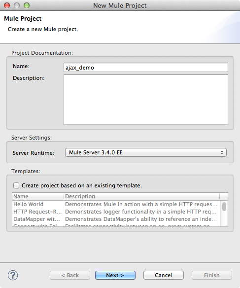
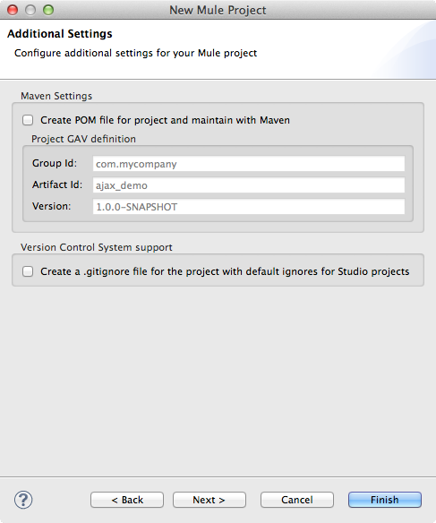
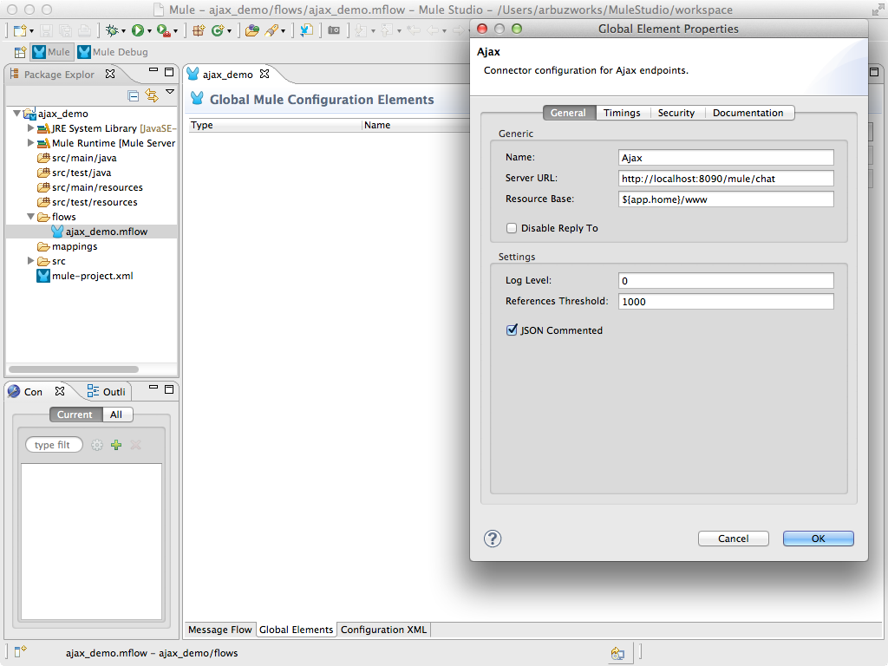
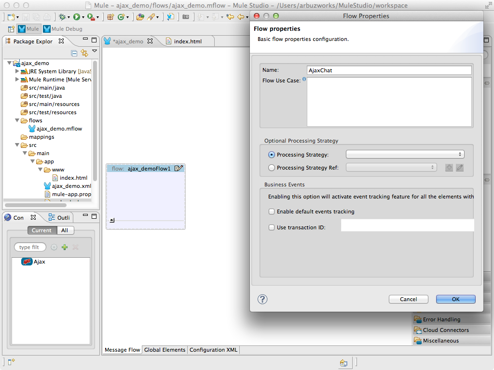
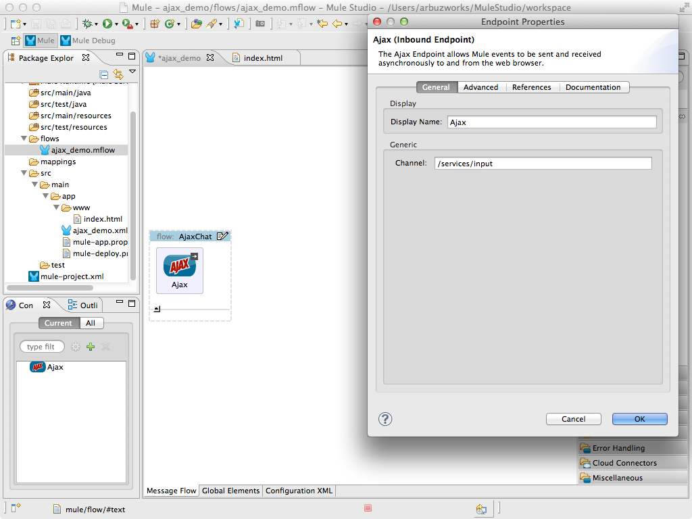
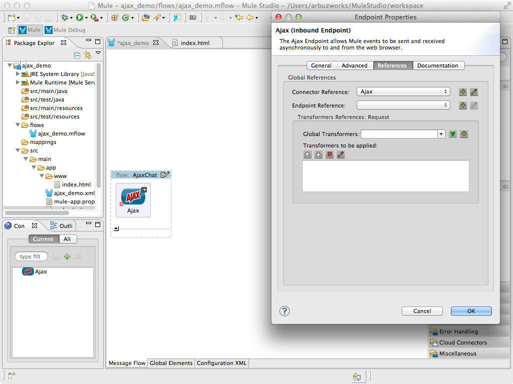
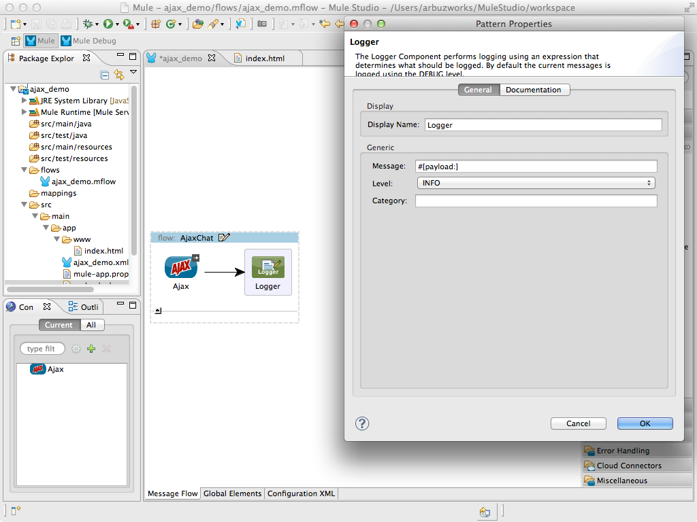
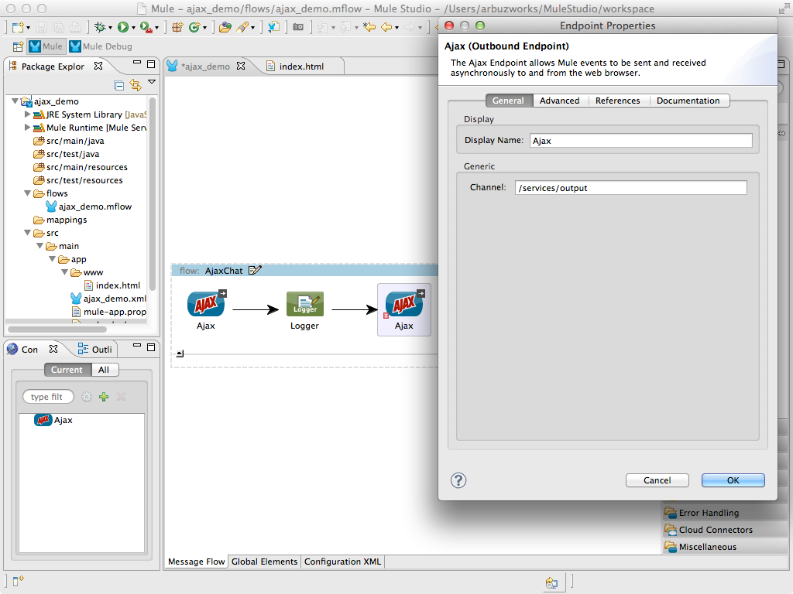
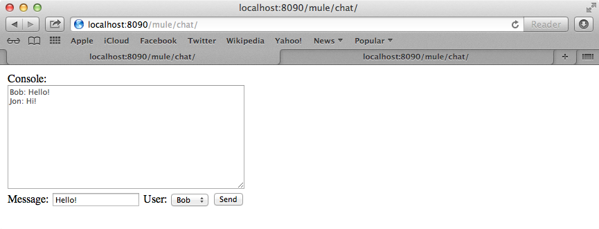
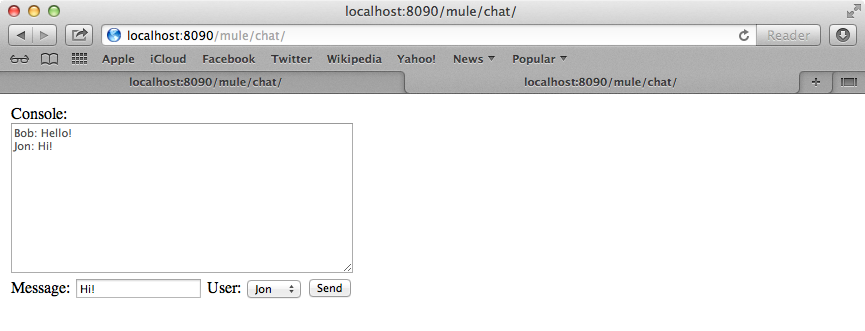

# AJAX Connector

The Mule AJAX Connector allows Mule events to be sent and received asynchronously to and from the web browser. The connector includes a JavaScript client that can be used to listen to events and to send events. 

### Contents

[Prerequisites](#prerequisites)    
[Step 1: Create Demo Project](#step1)  
[Step 2: Configure AJAX Connector](#step2)  
[Step 3: Create AjaxChat flow](#step3)  
[Step 4: Run project](#step4)  
[Step 5: Test AjaxEcho flow](#step4)  
[Other Resources](#other)  

### Prerequisites

In order to build and run this project you'll need [MuleStudio](http://www.mulesoft.org/download-mule-esb-community-edition).

### Step 1: Create Demo Project

* Run Mule Studio and select **File \> New \> Mule Project** menu item.  
* Type **ajax_demo** as a project name and click **Next**.  



* Then click **Finish**.



### Step 2: Configure AJAX Connector

Open **flows/ajax_demo.mflow** file. For configuration of AJAX Connector select the **Global Elements** tab, click **Create** button and using the filter find and select  **AJAX** in the list of connectors. Click **OK**. You will see a window for AJAX Connector configuration, adjust the fields as displayed on the following image.



This starts the AJAX server which is ready to start publishing and subscribing.

Create a new **src/main/app/www/index.html** file and add the following HTML code. 

```html
<!DOCTYPE>
<head>
    <script type="text/javascript" src="mule-resource/js/mule.js"></script>
    <script type="text/javascript">
	
    	function init(){
    		mule.subscribe("/services/output", function(data){
    	    	console.log(data.data);
    	    	document.getElementById('console').value += data.data + '\n';
    	    });
    	}    
    
        function publishToMule() {                       
            var message = document.getElementById('message').value;
            var user = document.getElementById('user').value;                        
            var text = user + ": " + message;                       
            mule.publish("/services/input", text);
        }      
    </script>
</head>
 
<body onLoad="init()">
	<table>
		<tr>
			<td colspan="2">
				<label>Console:</label><br/>
				<textarea id="console" style="width:100%; height:150px;" disabled="disabled"></textarea>
			</td>
		</tr>
		<tr>
			<td>
				<label>Message:</label> <input id="message" type="text"/>
				<label>User:</label>
		        <select id="user">
		            <option value="Bob">Bob</option>
		            <option value="Jon">Jon</option>
		            <option value="Sem">Sem</option>		            
		        </select>
			</td>
			<td>
				<input id="sendButton" class="button" type="submit" name="Go" value="Send" onclick="publishToMule();"/>	
			</td>
		</tr>
	</table>
 </body>
</html>
```

The browser will send messages to Mule (using the JavaScript Mule client) when a button is pushed. Also it will read all messages from Mule server and write them to the console.

### Step 3: Create AjaxChat flow

* Switch to the **Message Flow** tab in the flow editor.
* Add a new flow by dragging it from the Palette.
* Double click the new flow to open its properties and rename it to **AjaxChat**. Click **OK**.



* Drag **AJAX Endpoint** to the flow. Double click it to show its properties and set the **General \> Generic \> Channel** field as **/services/input**.



* Switch to the **References** tab and in the **Connector Reference** dropdown select the **Ajax** which we configured earlier on Step 2 and click **OK**.



* Add the **Logger** component to control the messages on the server side. Drag the **Logger** component to the flow. Double click it to show its properties and adjust them as displayed on the following image.



* Add **AJAX Endpoint** to the flow to send messages for subscribed users. Double click it to show its properties and set the **General \> Generic \> Channel** field as **/services/output**.



* Switch to the **References** tab and in the **Connector Reference** dropdown select  **Ajax** which we configured earlier on Step 2 and click **OK**.
* Save the flow.

### Step 4: Run project

* Right Click **src/main/app/ajax_demo.xml \> Run As/Mule Application**.

 

*    Check the console to see when the application starts.  

You should see a log message on the console:  
 
    ++++++++++++++++++++++++++++++++++++++++++++++++++++++++++++    
    + Started app 'ajax_demo'                                  +    
    ++++++++++++++++++++++++++++++++++++++++++++++++++++++++++++

### Step 5: Test AjaxEcho flow

* Open your browser and point it to [http://localhost:8090/mule/chat](http://localhost:8090/mule/chat). You will see the chat window. In the dropdown list select user Bob.
* Open your [http://localhost:8090/mule/chat](http://localhost:8090/mule/chat) in a new browser tab and in the dropdown list select user Jon.
* Write some message as Bob user and push the **Send** button. You will see the message on Bob's console and on Jon's console as well.
* Also you can see that messages on MuleStudio console.

 
 

### Other Resources

For more information on:

- Mule AnyPoint® connectors, please visit [http://www.mulesoft.org/connectors](http://www.mulesoft.org/connectors)
- Mule platform and how to build Mule apps, please visit [http://www.mulesoft.org/documentation/display/current/Home](http://www.mulesoft.org/documentation/display/current/Home)
