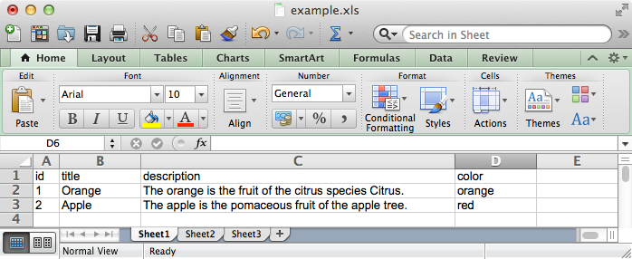
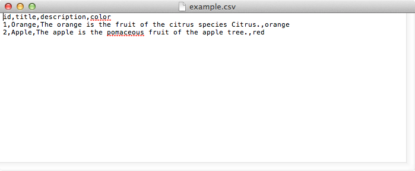
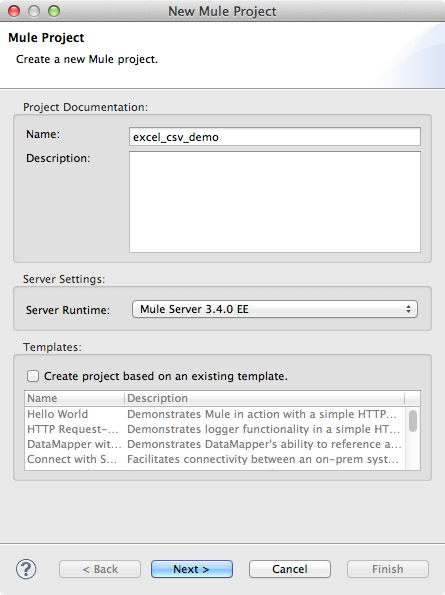
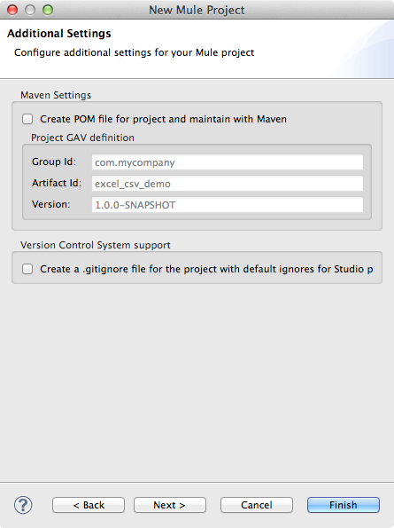
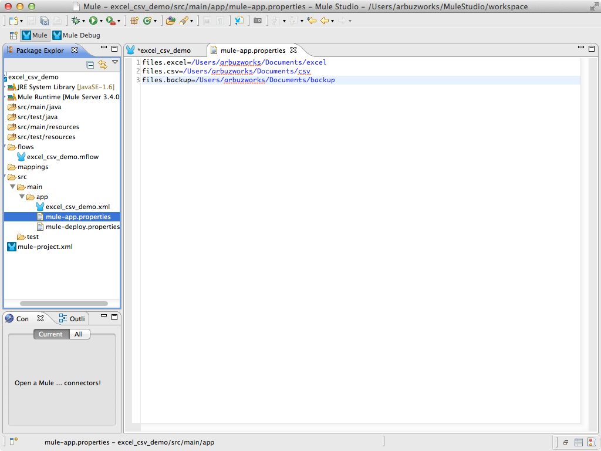
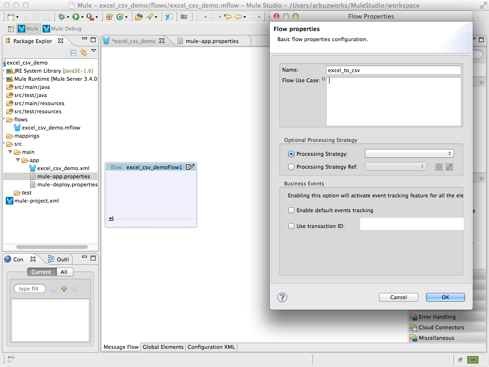
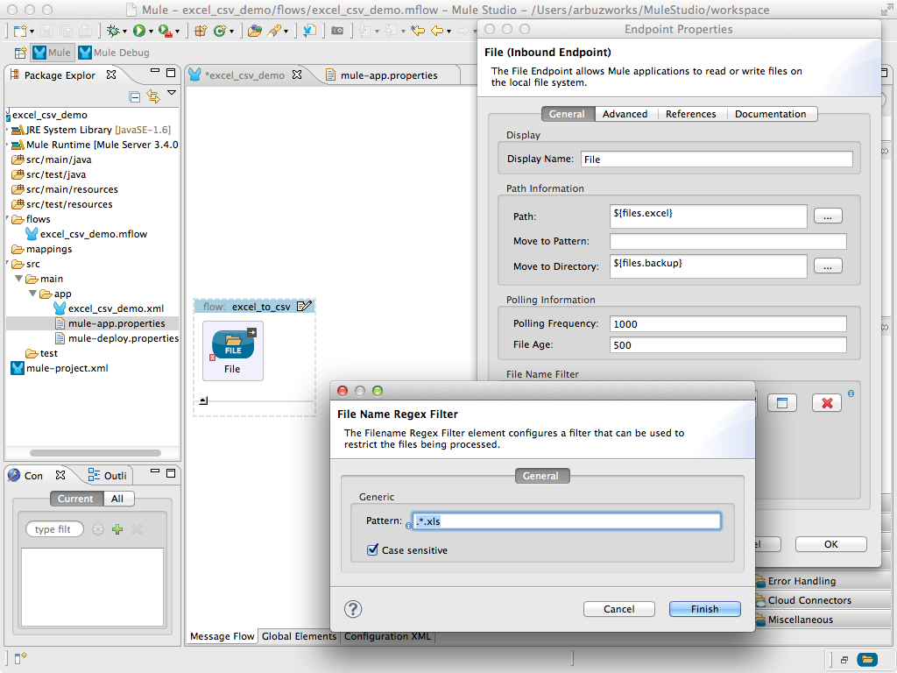
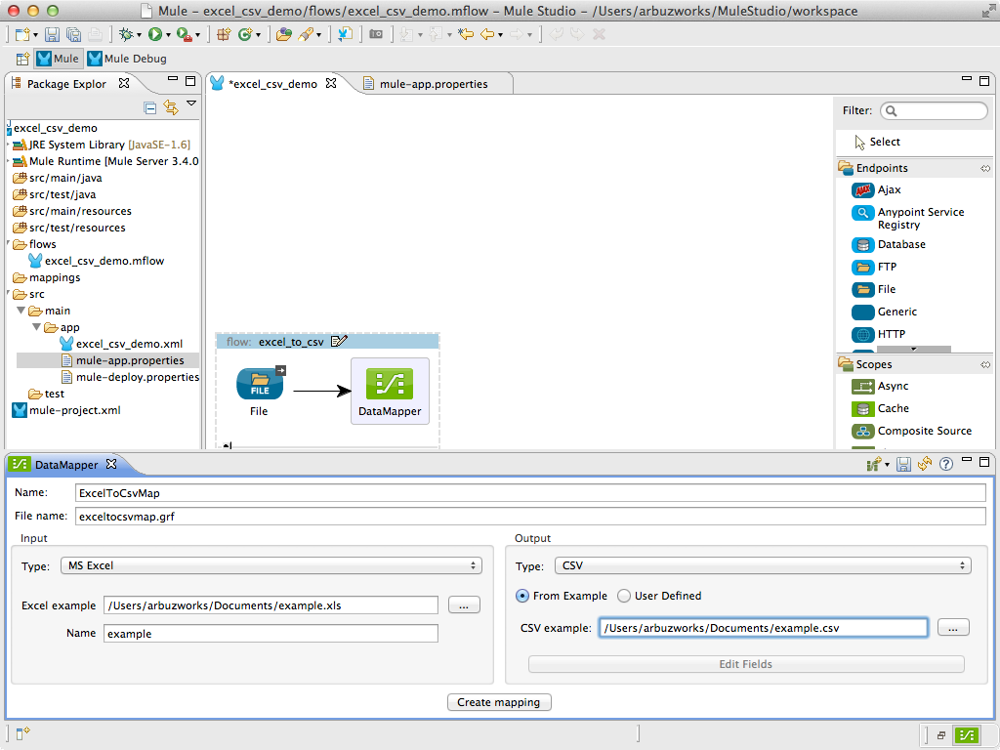
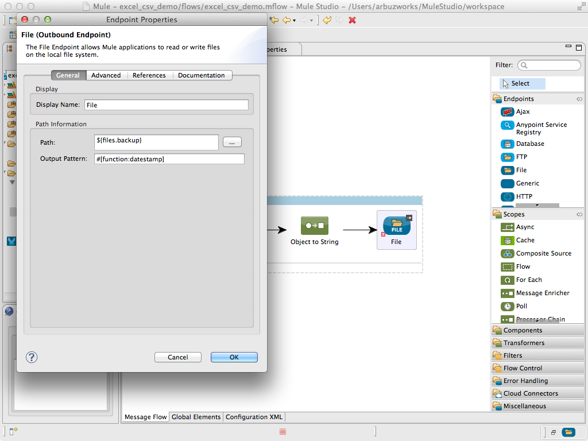

# DataMapper Excel to CSV

This example illustrates Mule ESB's ability to transform files from Excel format to CSV. This document will help you understand some of the ways you can use Anypoint™ DataMapper to transform data formats in Mule ESB applications.

### Contents 

[Prerequisites](#prerequisites)    
[Step 1: Create Demo Project](#step1)   
[Step 2: Configure application](#step2)  
[Step 3: Create excel_to_csv flow](#step3)   
[Step 4: Run project](#step4)   
[Step 5: Test excel_to_csv flow](#step5)   
[Other Resources](#other)   

### Prerequisites

In order to build and run this project you'll need:

* Three directories for the files:
    - **/Users/arbuzworks/Documents/excel** - the directory for containing original Excel files
    - **/Users/arbuzworks/Documents/csv** - the directory for containing converted CSV files
    - **/Users/arbuzworks/Documents/backup** - the directory for containing copy of original Excel files
* An **example.xsl** Excel file with table columns:
    - id   
    - title   
    - description
    - color



* An **example.csv** CSV file with the same columns as in the Excel file.



### Step 1: Create Demo Project

* Run Mule Studio and select **File \> New \> Mule Project** menu item.  
* Type **excel_csv_demo** as a project name and click **Next**.  



* Then click **Finish**.



### Step 2: Configure application

We need to provide values for the parameters which we will use in the application. Open **src/main/app/flows/mule-app.properties** file and add the following lines:

```
files.excel=/Users/arbuzworks/Documents/excel
files.csv=/Users/arbuzworks/Documents/csv
files.backup=/Users/arbuzworks/Documents/backup
```



### Step 3: Create excel_to_csv flow

* Switch to the **Message Flow** tab in the flow editor.
* Add a new flow by dragging it from the Palette.
* Double click the new flow to open its properties and rename it to **excel_to_csv**. Click **OK**.



* Drag **File** endpoint to the flow. Double click it to show its properties and adjust them as displayed on the following image.
* In the **File Name Filter** section of the Endpoint Properties window, click the **+** button to edit the regular expression used to filter files. Set **Pattern** field as **.*.xls**. Click **Finish**.



* Click **OK** to close **File** endpoint window configuration.
* Drag **DataMapper** transformer to the flow. Double click it to create a mapping flow file. Set the **Name** field as **ExcelToCsvMap**. 
* In the **Type** dropdown of the **Input** section select **MS Excel** and in the **Excel example** field select the **examle.xls** file which you created earlier.
* In the **Type** dropdown of the **Output** section select **CSV** and in the **CSV example** field select the **examle.xls** file which you created earlier. Select as active **From Example** radiobutton. Click **Create mapping** button.



* **Data Mapping** window shows us the mapping of Excel data to CSV format.

* Add **Object to String** transformer to the flow. Double click it and in configuration window in the **MIME Type** dropdown field select the **text/plain** option. Click **OK**.

* Drag **File** endpoint to the flow. Double click it to show its properties and configure it to save CSV files.



### Step 4: Run project

* Right Click **src/main/app/excel_csv_demo.xml \> Run As/Mule Application**.

 

* Check the console to see when the application starts.  

You should see a log message on the console:  
 
    ++++++++++++++++++++++++++++++++++++++++++++++++++++++++++++    
    + Started app 'excel_csv_demo'                              +    
    ++++++++++++++++++++++++++++++++++++++++++++++++++++++++++++   

It means that our application is successfully started.


### Step 5: Test excel_to_csv flow

* **File** endpoint regularly polls the contents of the **files.excel** directory to detect any file with **.xls** extension. When you copy any **.xls** file in format of the **example.xsl** file into the **files.excel** directory, the application detects it, tries to convert this file to the CSV format and saves in the **files.csv** directory. Original Excel file will be removed from the **files.excel** directory and will be placed to the **files.backup** directory.
* Stop Mule server.

### Other Resources

For more information on:

- Mule AnyPoint® connectors, please visit [http://www.mulesoft.org/connectors](http://www.mulesoft.org/connectors)
- Mule platform and how to build Mule apps, please visit [http://www.mulesoft.org/documentation/display/current/Home](http://www.mulesoft.org/documentation/display/current/Home)