# SMTP/POP3/IMAP Connectors

The SMTP Connector can be used for sending messages over SMTP using javax.mail API. The implementation supports CC/BCC/ReplyTo addresses, attachments and custom Header properties. 

The POP3 Connector can be used for receiving messages from POP3 inboxes. The POP3S Connector connects to POP3 mailboxes using javax.mail API.

The IMAP Connector can be used for receiving messages from IMAP inboxes using the javax.mail API. The IMAPS Connector uses secure connections over SSL/TLS.

### Contents

[Prerequisites](#prerequisites)  
[Step 1: Create Demo Project](#step-1-create-demo-project)  
[Step 2: Configure application](#step-2-configure-application)  
[Step 3: Create outcomingSmtp flow](#step-3-create-outcomingsmpt-flow)  
[Step 4: Run project](#step-4-run-project)  
[Step 5: Test outcomingSmtp flow](#step-5-test-outcomingsmtp-flow)  
[Step 6: Create incomingPop3 flow](#step-6-create-incomingpop3-flow)  
[Step 7: Test incomingPop3 flow](#step-7-test-incomingpop3-flow)  
[Step 8: Create incomingImap flow](#step-8-create-incomingimap-flow)  
[Step 9: Test incomingImap flow](#step-9-test-incomingimap-flow)  
[Other Resources](#other-resources)  

### Prerequisites

In order to build and run this project you'll need:

*  [MuleStudio](http://www.mulesoft.org/download-mule-esb-community-edition).
*  Configured and operating email server with enabled SMTP, POP3 and IMAP protocols for your account.
*  You need to know the connection parameters for the email server. For each protocol they are:    
    * host    
    * port    
    * username    
    * password     

*  Create the following directories to synchronize them with the email server:
    * /Users/arbuzworks/Documents/smtp    
    * /Users/arbuzworks/Documents/pop3    
    * /Users/arbuzworks/Documents/imap    
  
### Step 1: Create Demo Project

*    Run Mule Studio and select **File \> New \> Mule Project** menu item.  
*    Type **email_demo** as a project name and click **Next**.  

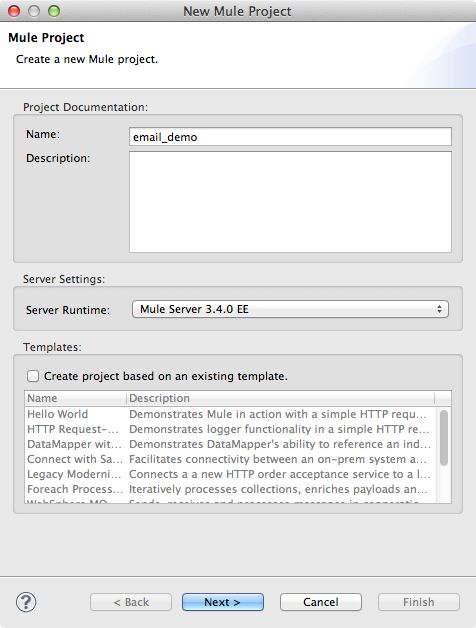

*    Then click **Finish**.

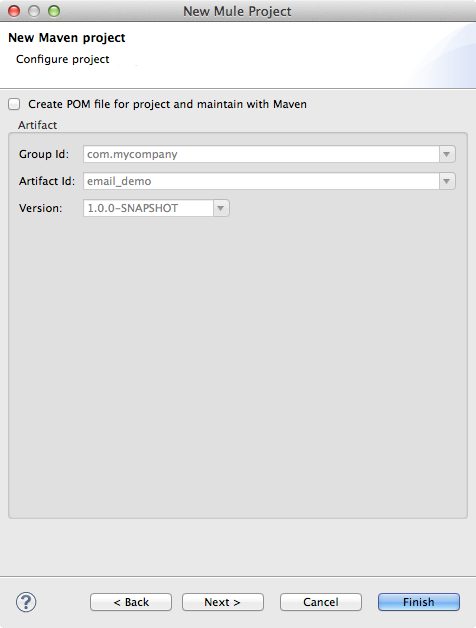


### Step 2: Configure application 
    
We need to provide values for the parameters of the SMTP/POP3/IMAP protocols. Open **src/main/app/flows/mule-app.properties** file and add the following lines:   
```ini    
smtp.host=smtp.localhost    
smtp.port=25    
    
pop3.host=pop3.localhost    
pop3.port=110    
    
imap.host=imap.localhost    
imap.port=993   
    
email.username=username    
email.password=password    
    
file.outcomingSmtp=/Users/arbuzworks/Documents/smtp     
file.incomingPop3=/Users/arbuzworks/Documents/pop3    
file.incomingImap=/Users/arbuzworks/Documents/imap    
    
header.to=email_to@example.com    
header.from=email_from@example.com    
header.subject=Test email subject    
```

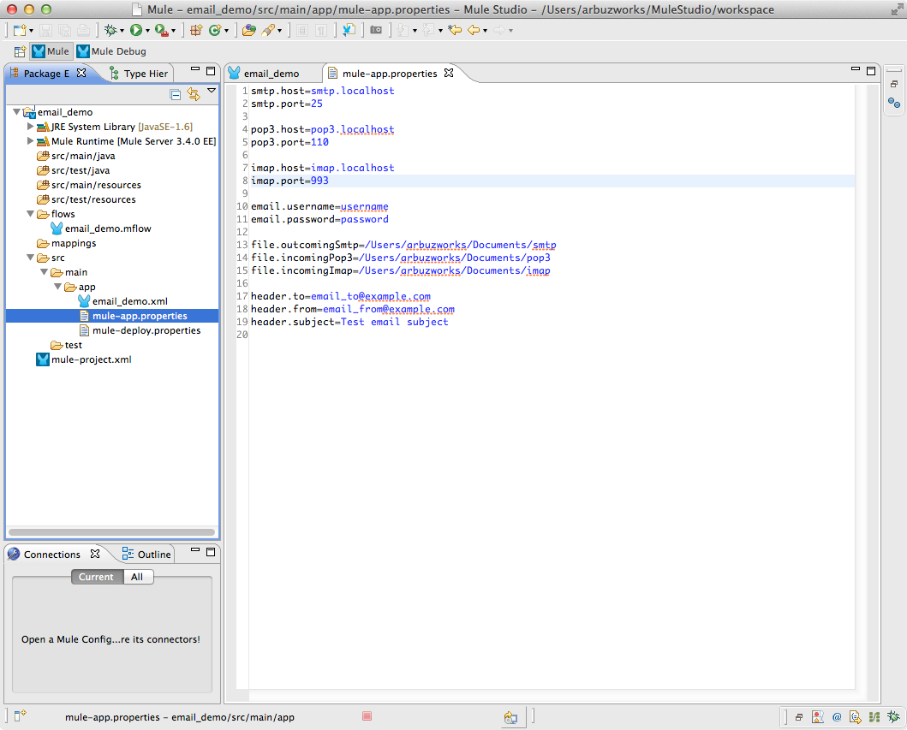

You have to consider the following things before you test the application:

*   The **email.username** attribute uses **%40** escape code to replace the **@** symbol.    
*   Similar to the **email.username** attribute, the **email.password** needs the **%40** escape code every time you want to place **@** as well.    
*   Note that in **header.from** and **header.to** attributes the **@** symbol will work perfectly.    


### Step 3: Create outcomingSmtp flow

*    Switch to the **Message Flow** tab in the flow editor.
*    Add a new flow by dragging it from the Palette.
*    Double click the new flow to open its properties and rename it to **outcomingSmtp**. Click **OK**.

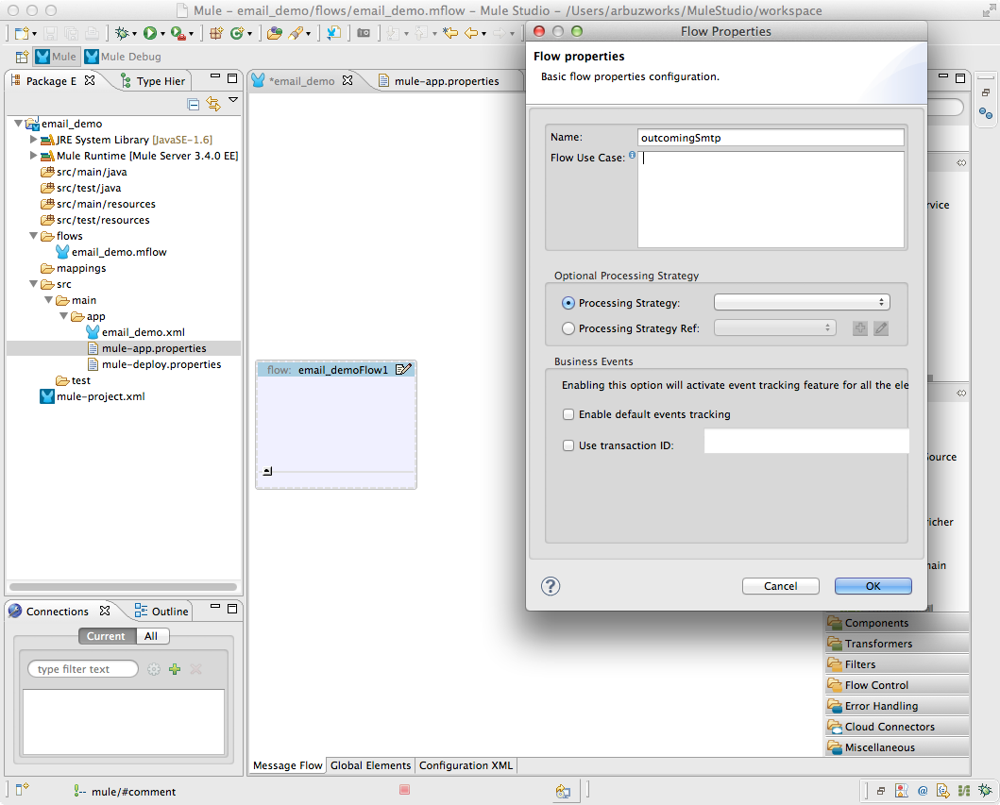

*    Drag **File Endpoint** to the flow. Double click it to show its properties and adjust them as displayed on the following image.

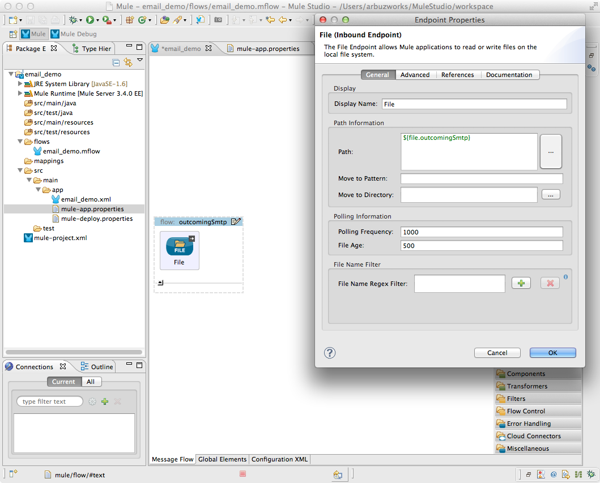

*    Drag **SMTP Endpoint** to the flow. Double click it to show its properties and adjust configs of the SMTP server as displayed on the following image.

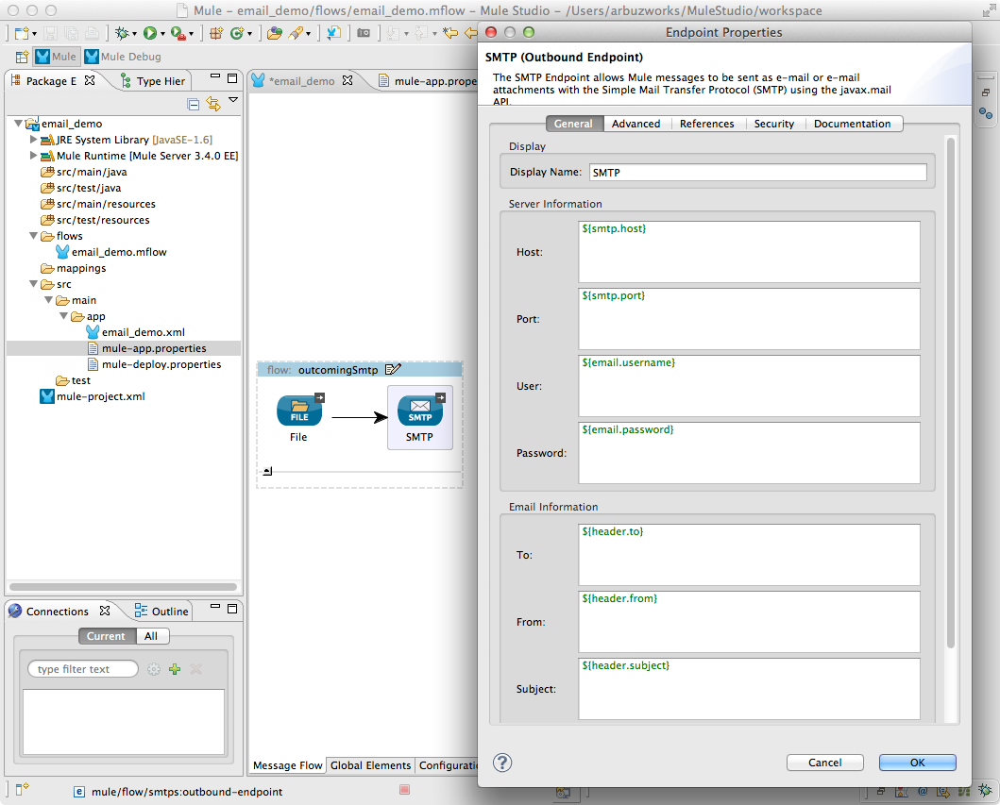

*   Switch to the **Advanced** tab and in the **MYME type** dropdown select  **text/plain**.

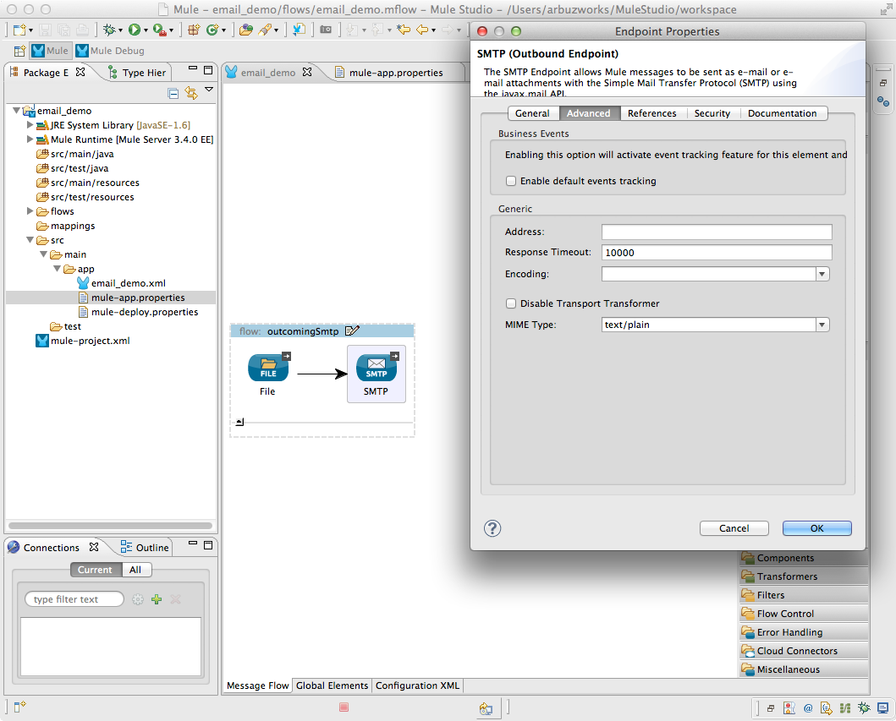

*   Then click **OK**.
*   Save the flow.

### Step 4: Run project

*   Right Click **src/main/app/email_demo.xml \> Run As/Mule Application**.


*   Check the console to see when the application starts.        
 
You should see a log message on the console:    
 
    ++++++++++++++++++++++++++++++++++++++++++++++++++++++++++++    
    + Started app 'email_demo'                                 +
    ++++++++++++++++++++++++++++++++++++++++++++++++++++++++++++
    
### Step 5: Test outcomingSmtp flow

*   When the application is started, open your file manager and paste a text file to the **${file.outcomingSmtp}** directory.
* 	Open your user **${header.to}** mailbox and you should see a new email from the user **${header.from}** with the subject **${header.subject}**. 
* 	Stop Mule server.

### Step 6: Create incomingPop3 flow

*    Add a new flow by dragging it from the Palette.
*    Double click the new flow to open its properties and rename it to **incomingPop3**. Click **OK**.

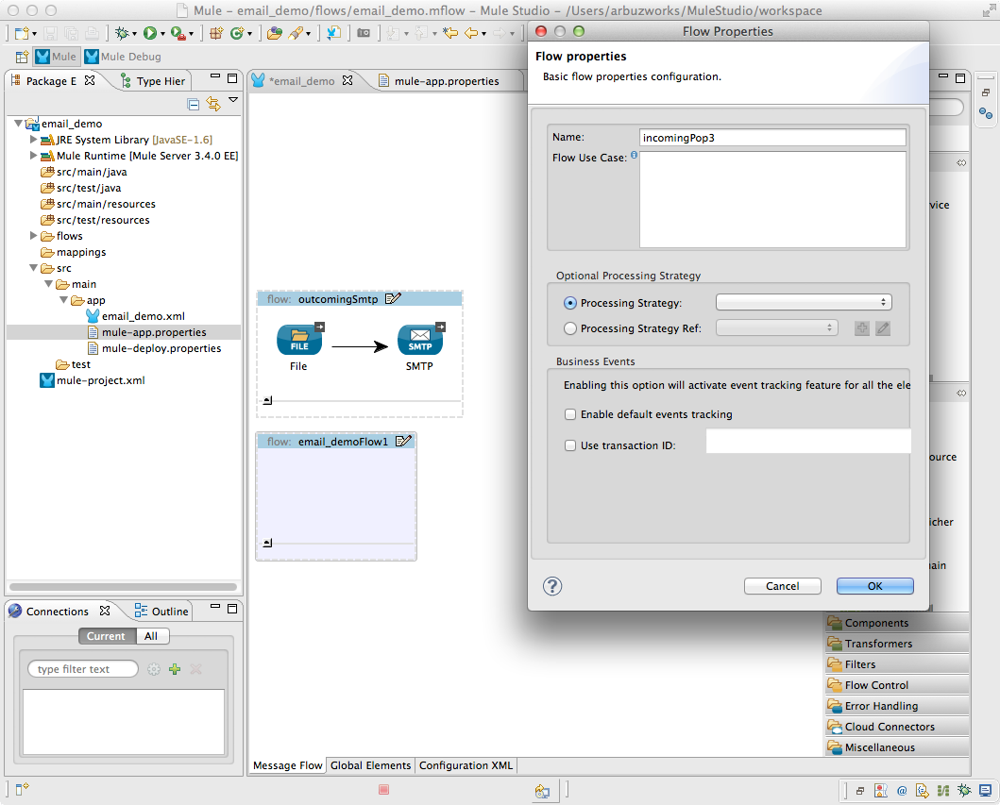

*    Drag **POP3 Endpoint** to the flow. Double click it to show its properties and adjust configs of the POP3 server as displayed on the following image.

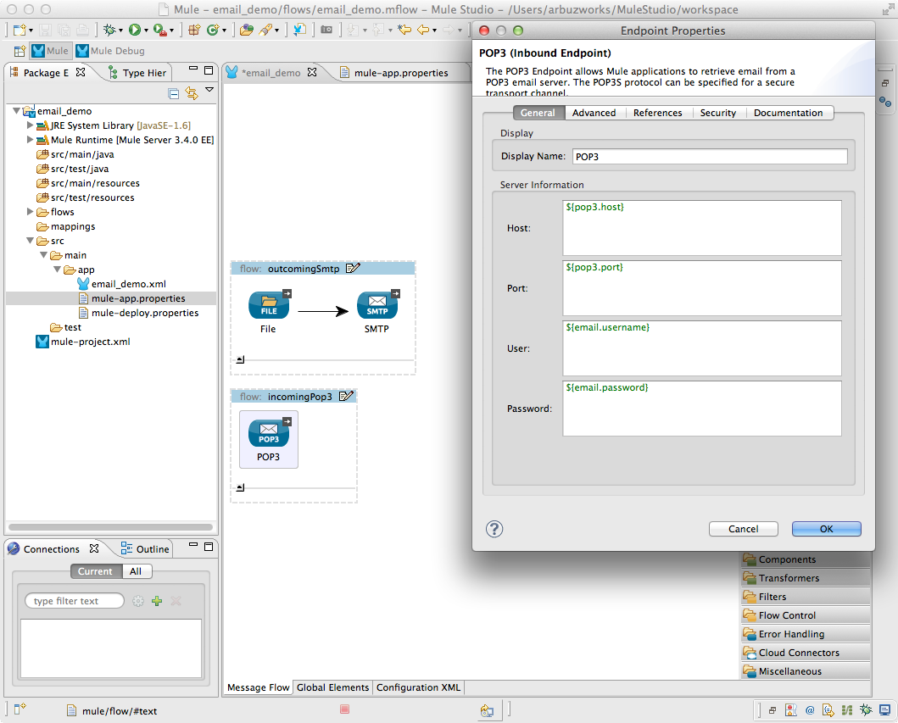

*   Then click **OK**.

*    Drag **File Endpoint** to the flow. Double click it to show its properties and adjust them as displayed on the following image.

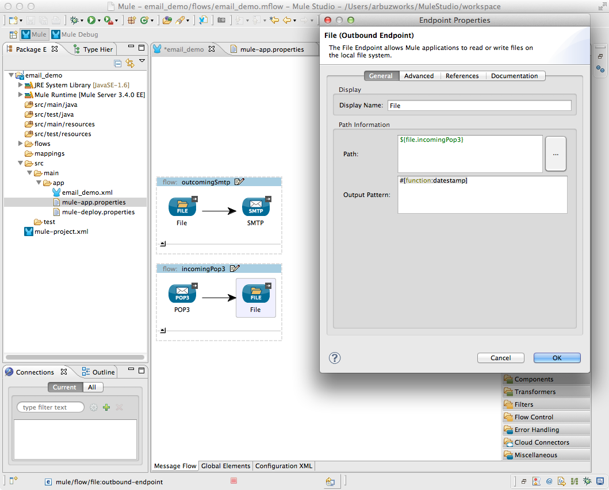

*    Switch to the **Advanced** tab and in the **MYME type** dropdown select  **text/plain** and click **OK**.

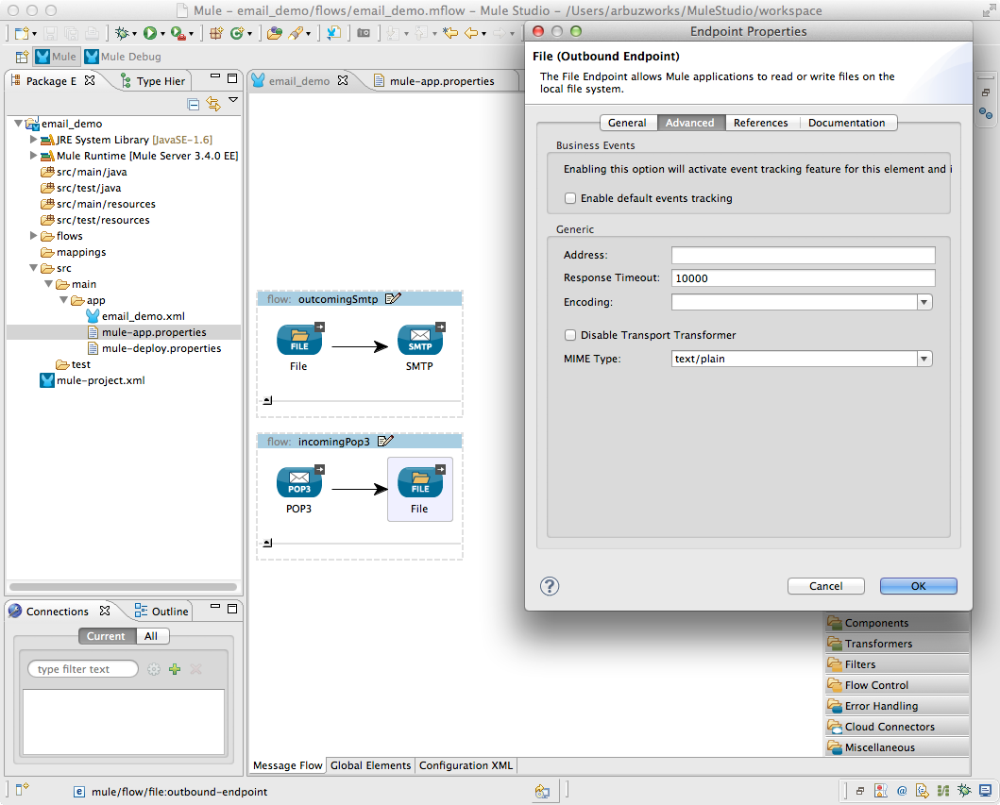

*    Save the flow.

### Step 7: Test incomingPop3 flow

*   Run the project.
*   Open your mailbox and send an email with a text message to the email address of the user **${email.username}**.
*   Open the **${file.incomingPop3}** directory  and you should see a new file with the name of creation time. The file will contain the text message of the email.
*   Stop Mule server.

### Step 8: Create incomingImap flow

*    Add a new flow by dragging it from the Palette.
*    Double click the new flow to open its properties and rename it to **incomingImap**. Click **OK**.

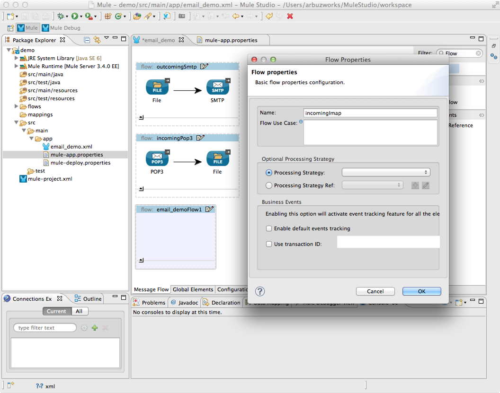

*    Drag **IMAP Endpoint** to the flow. Double click it to show its properties and adjust configs of the IMAP server as displayed on the following image.

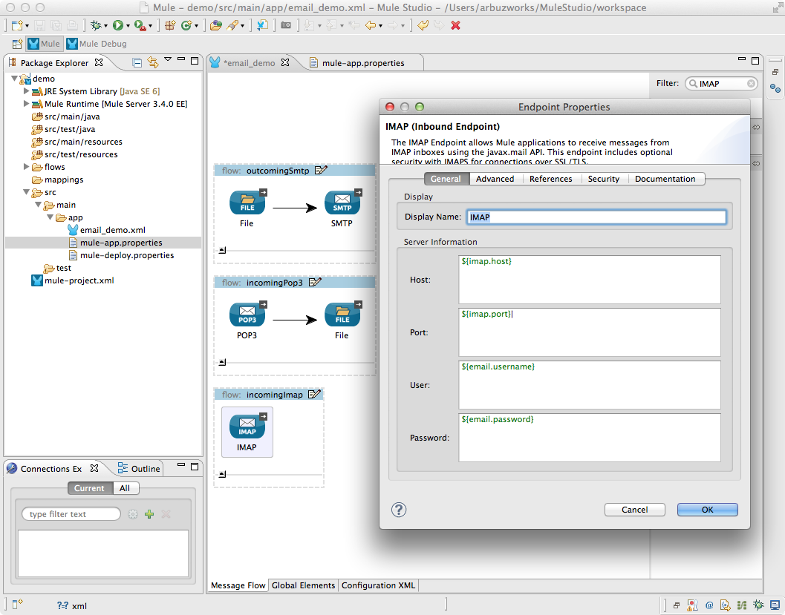

*   Then click **OK**.

*    Drag **File Endpoint** to the flow. Double click it to show its properties and adjust them as displayed on the following image.

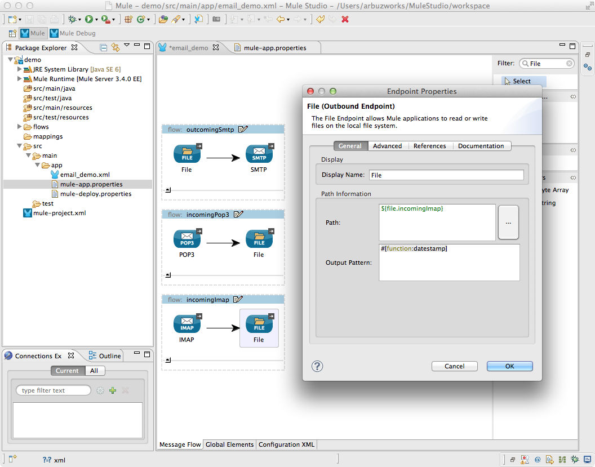

*    Switch to the **Advanced** tab and in the **MYME type** dropdown select  **text/plain** and click **OK**.

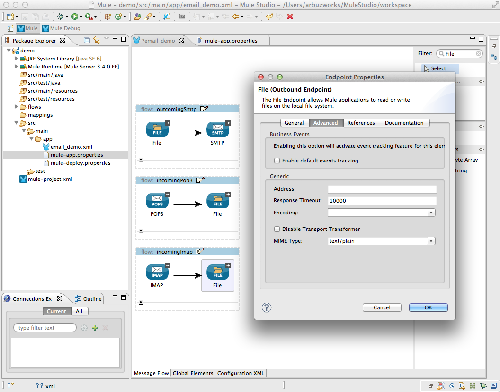

*    Save the flow.

### Step 9: Test incomingImap flow

*   Run the project.
*   Open your mailbox and send an email with a text message to the email address of the user **${email.username}**.
*   Open the **${file.incomingImap}** directory and you should see a new file with the name of creation time. The file will contain the text message of the email.
*   Stop Mule server.

### Other Resources   

For more information on:

- Mule AnyPoint® connectors, please visit [http://www.mulesoft.org/connectors](http://www.mulesoft.org/connectors)
- Mule platform and how to build Mule apps, please visit [http://www.mulesoft.org/documentation/display/current/Home](http://www.mulesoft.org/documentation/display/current/Home)
