# GitHub Connector

[Purpose](#purpose)		
[Prerequisites](#prerequisites)    
[Step 1: Prepare database](#step-1-install-mule-gitHub-connector-from-update-site)    
[Step 2: Create Demo Project](#step-2-create-demo-project)   
[Step 3: Configure GitHub Cloud Connector](#step-3-configure-gitHub-cloud-connector)  
[Step 4: Create createRepository flow](#step-4-create-createrepository-flow)  
[Step 5: Run project](#step-5-run-project)   
[Step 6: Test createRepository flow](#step-6-test-createrepository-flow)    
[Step 7: Create createIssue flow](#step-7-create-createissue-flow)     
[Step 8: Test createIssue flow](#step-8-test-createissue-flow)   
[Step 9: Create createComment flow](#step-9-create-createcomment-flow)   
[Step 10: Test createComment flow](#step-10-test-createcomment-flow)   
[Step 11: Create editComment flow](#step-11-create-editcomment-flow)   
[Step 12: Test editComment flow](#step-12-test-editcomment-flow)   
[Other Resources](#other-resources)     

### Purpose

This document provides detailed instructions on how to install MuleSoft's GitHub connector and demonstrates how to build and run a simple demo application that uses this connector.

### Prerequisites

In order to build and run this project you'll need:

*   [GitHub account](https://github.com/);   
*   [MuleStudio](http://www.mulesoft.org/download-mule-esb-community-edition);  
*   Web browser.  

### Step 1: Install Mule Github Connector From Update Site

*   In Mule Studio select Help > Install New Software....   
*   Select MuleStudio Cloud Connectors Update Site in the Work With dropdown.   
*   Find Github Connector Mule Studio Extension by typing a word **GitHub** in a filter string and click Next.  
*   Follow installation steps.  

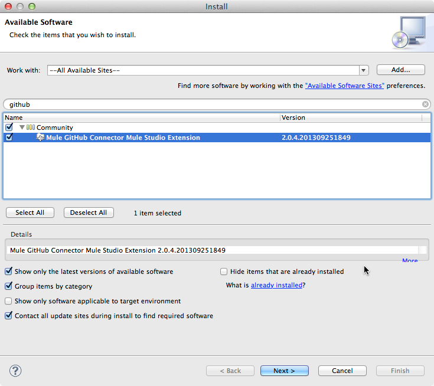 

### Step 2: Create Demo Project

*    Run Mule Studio and select **File \> New \> Mule Project** menu item.  
*    Type **demo** as a project name and click **Next**.  


*    Then click **Next**.


*    And finally click **Finish**.


### Step 3: Configure GitHub Cloud Connector

Open **flows/demo.mflow** file. For configuration of the GitHub Cloud Connector select the **Global Elements** tab, click **Create** button and using the filter find and select **GitHub Cloud Connector**. Click **OK**. You will see a window for **GitHub Cloud Connector** configuration, adjust the fields as it is displayed on the following image.  

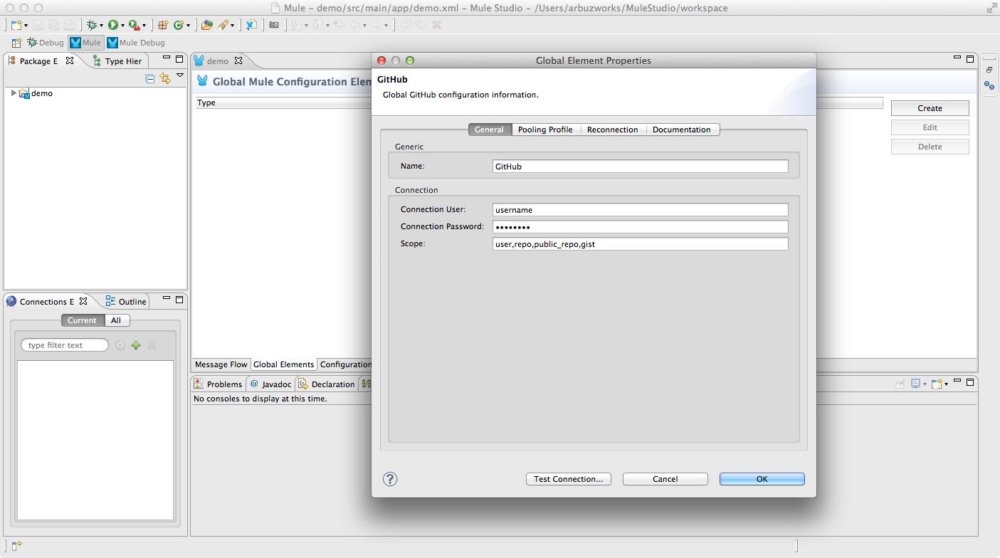

### Step 4: Create createRepository flow

*    Switch to the **Message Flow** tab in the flow editor.   
*    Add a new flow by dragging it from the Palette.    
*    Double click the new flow to open its properties and rename it to **createRepository**. Click **OK**.   

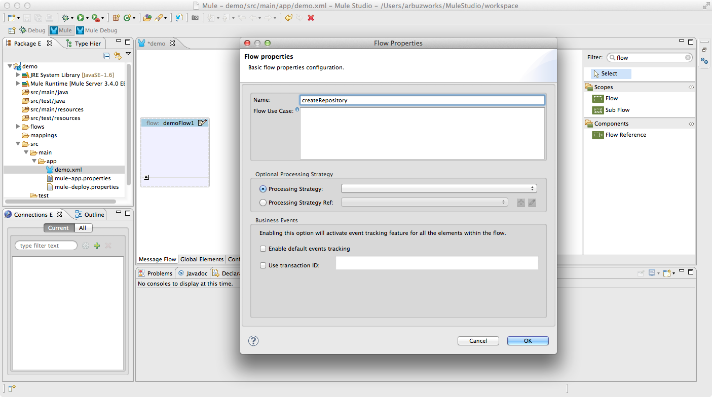 

*    Drag **HTTP Endpoint** to the flow. Double click it to show its properties and adjust them as it is displayed on the following image.   

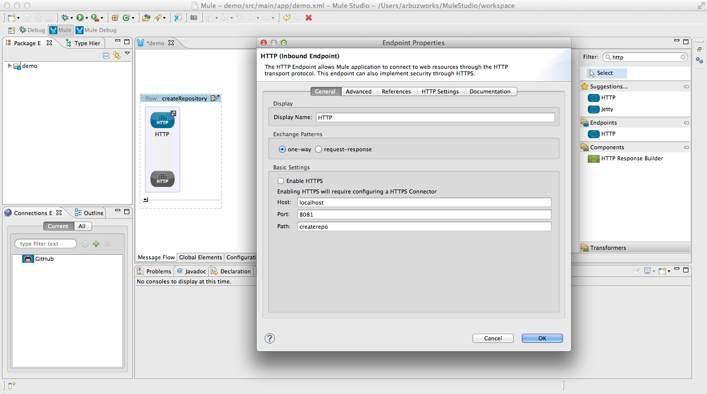 

*    Find the **GitHub** Cloud Connector and drag it to the flow. Double click it to show its properties. Set **Display name** as **GitHub. Create repository**. Adjust the rest of fields as it is shown on the following image. 

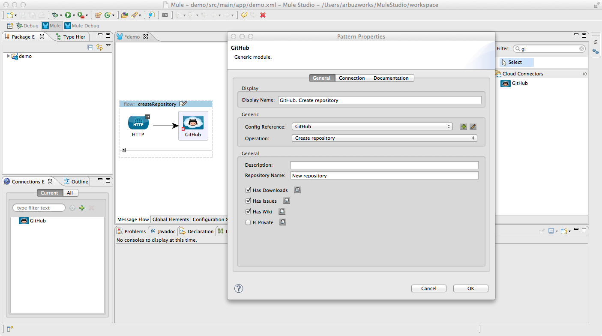 

*    Save the flow. 

### Step 5: Run project

*    Right Click **src/main/app/demo.xml \> Run As/Mule Application**.

 

*    Check the console to see when the application starts.  

You should see a log message on the console:  
 
    ++++++++++++++++++++++++++++++++++++++++++++++++++++++++++++    
    + Started app 'demo'                                       +    
    ++++++++++++++++++++++++++++++++++++++++++++++++++++++++++++   

### Step 6: Test createRepository flow

*    Once the application is started, open your browser and point it to [http://localhost:8081/createrepo](http://localhost:8081/createrepo).   
*    Then log on GitHub using your credentials. Find the **Repositories** tab and click it, you should see a page showing you newly created repository.  

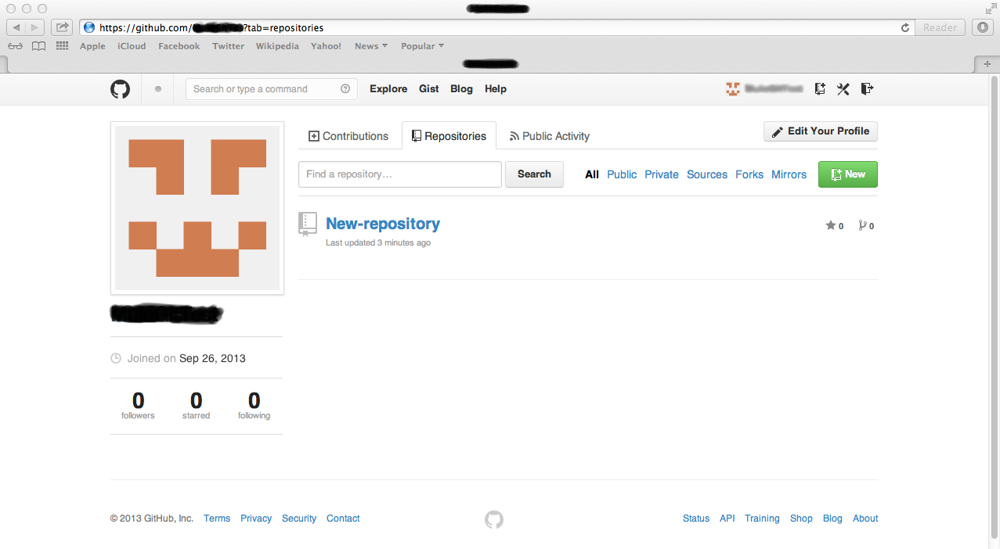 

*    Stop Mule server. 

### Step 7: Create createIssue flow

*    Add a new flow by dragging it from the Palette.    
*    Double click the new flow to open its properties and rename it to **createIssue**. Click **OK**.   
*    Then drag **HTTP Endpoint** to the flow. Double click it to show its properties and adjust them as it is displayed on the following image.    

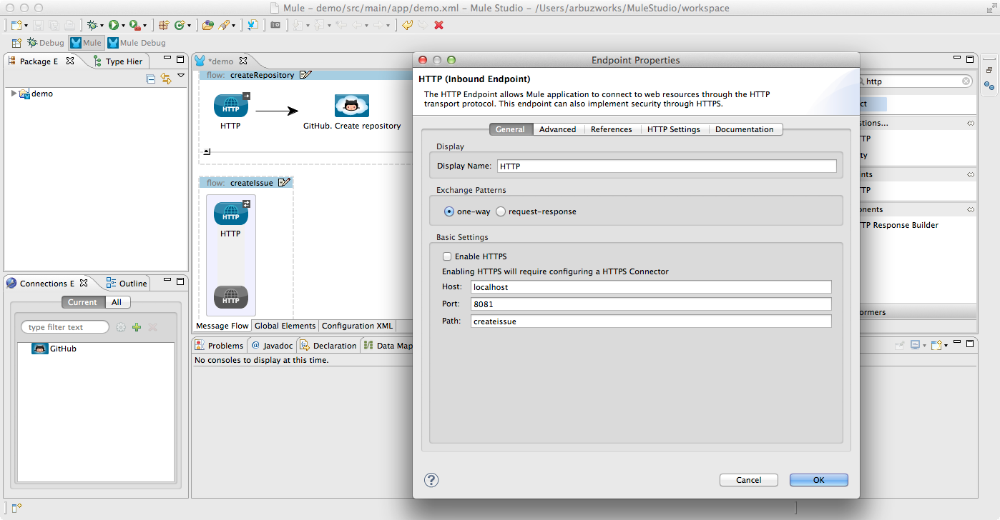 

*    Find the **GitHub** Cloud Connector and drag it to the flow. Double click it to show its properties. Set **Display name** as **GitHub. Create issue**. Adjust the rest of  fields as it is shown on the following image. Put whatever text you want in the **Body** field; type in the name of the repository you have just created in the **Repository** field; name the issue using the **Title** field.    

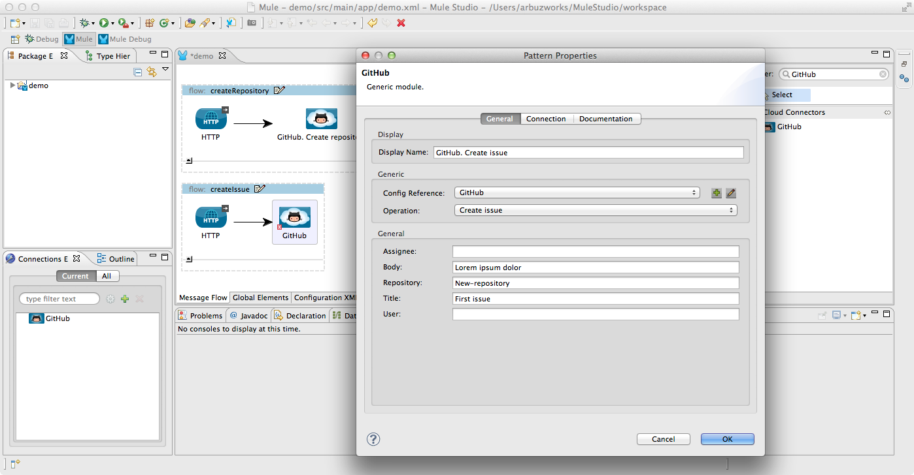 

### Step 8: Test createIssue flow

*    Run mule application.  
*    Once the application is started, open your browser and point it to [http://localhost:8081/createissue](http://localhost:8081/createissue).   
*    Switch to your previously opened page on **GitHub**. Find the **Contributions** tab and click it. At the bottom of the page you should see something like that . The number that goes before the issue title is the issue id.  Click the issue title, you should see a page with your issue open. Notice, that the issue body contains the same text you have put in the **Body** field.    

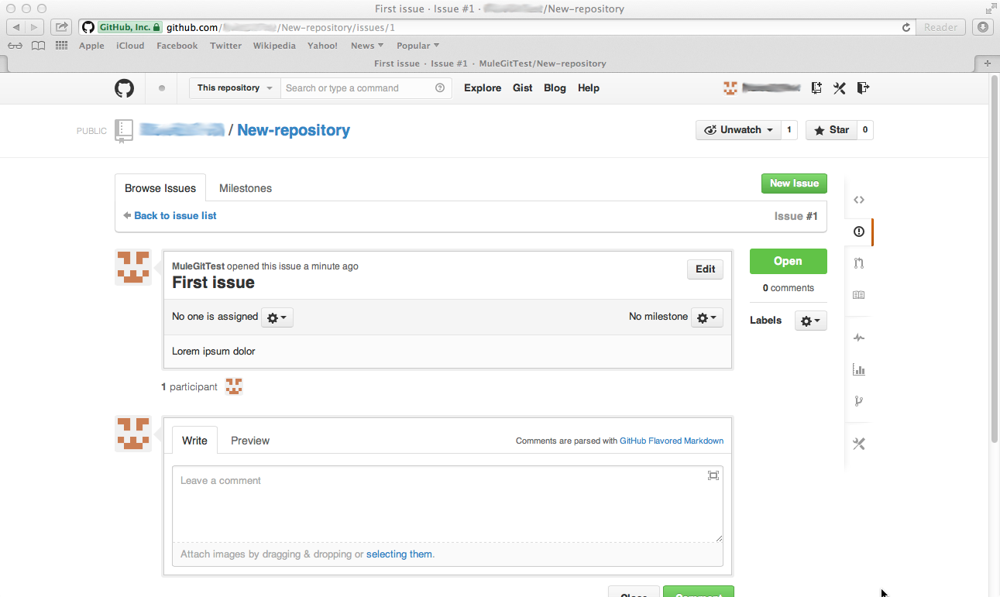 

*    Stop Mule server.  

### Step 9: Create createComment flow

*    Add a new flow by dragging it from the Palette.    
*    Double click the new flow to open its properties and rename it to **createComment**. Click **OK**.   
*    Then drag **HTTP Endpoint** to the flow. Double click it to show its properties and adjust them as it is displayed on the following image.    

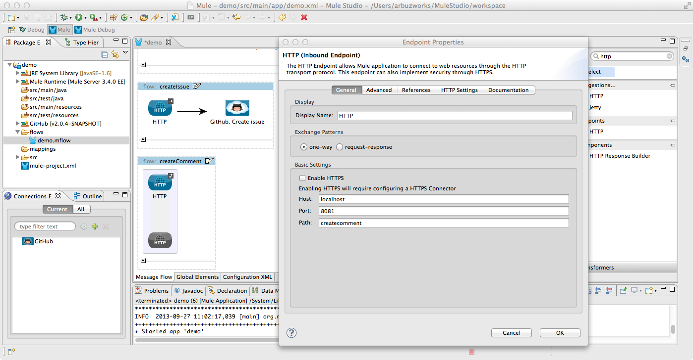 

*    Find **GitHub** Cloud Connector and drag it to the flow. Double click it to show its properties. Set **Display name** as **GitHub. Create comment**. Adjust the rest of fields as it is shown on the following image. Name a comment using the **Comment** field; put the issue id in the **Issue Id** field; type in the name of the repository you have just created in the **Repository** field. 

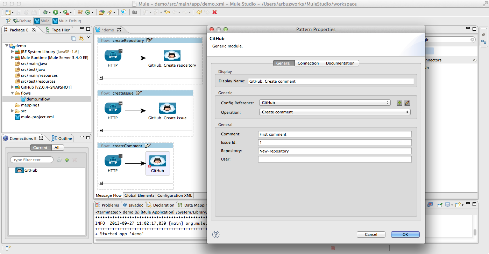 

### Step 10: Test createComment flow

*    Run mule application.  
*    Once the application is started, open your browser and point it to [http://localhost:8081/createcomment](http://localhost:8081/createcomment).   
*    Switch to your previously opened page on **GitHub** and refresh it. You should see a new comment.     

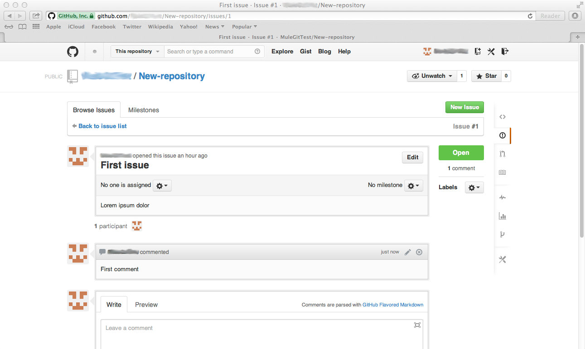 

*    Stop Mule server.  

### Step 11: Create editComment flow

*    Add a new flow by dragging it from the Palette.    
*    Double click the new flow to open its properties and rename it to **editComment**. Click **OK**.   
*    Then drag **HTTP Endpoint** to the flow. Double click it to show its properties and adjust them as it is displayed on the following image.    

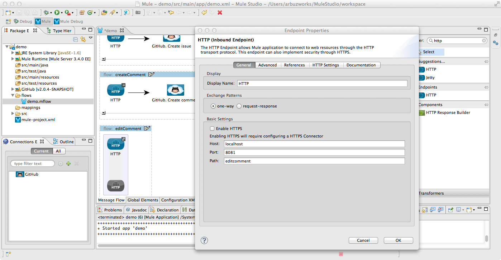 

*    Find the **GitHub** Cloud Connector and drag it to the flow. Double click it to show its properties. Set **Display name** as **GitHub. Edit comment**. Adjust the rest of fields as it is shown on the following image. Type in the name of the repository you have just created in the **Repository** field; put the comment id in the **Comment Id** field (it may be found by clicking the comment icon -  switching to the previously opened page on GitHub, then in the address line find something similar to ```1#issuecomment-25231286```, that long number is the required comment id); put a new text for the comment in the **Body** field.

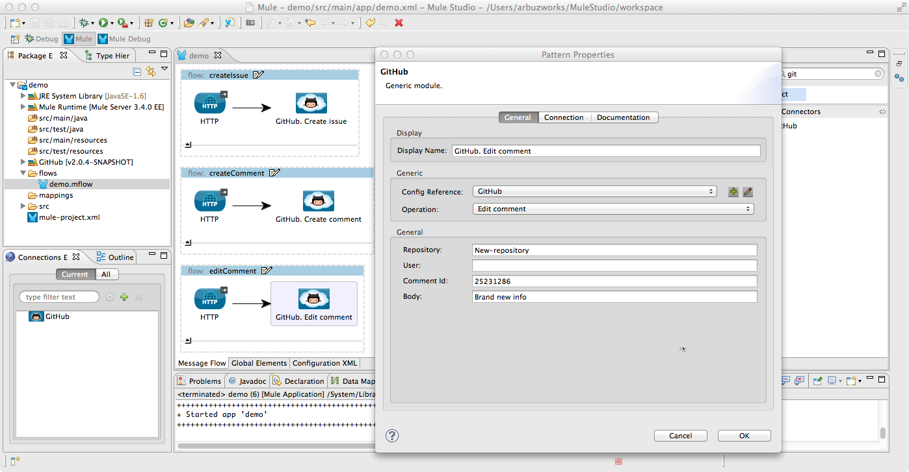 

### Step 12: Test editComment flow

*    Run mule application.  
*    Once the application is started, open your browser and point it to [http://localhost:8081/editcomment](http://localhost:8081/editcomment).   
*    Switch to your previously opened page on **GitHub** and refresh it. You should see a comment with new text.     

 

### Other Resources

For more information on:

- Mule AnyPoint® connectors, please visit [http://www.mulesoft.org/connectors](http://www.mulesoft.org/connectors)
- Mule platform and how to build Mule apps, please visit [http://www.mulesoft.org/documentation/display/current/Home](http://www.mulesoft.org/documentation/display/current/Home)


