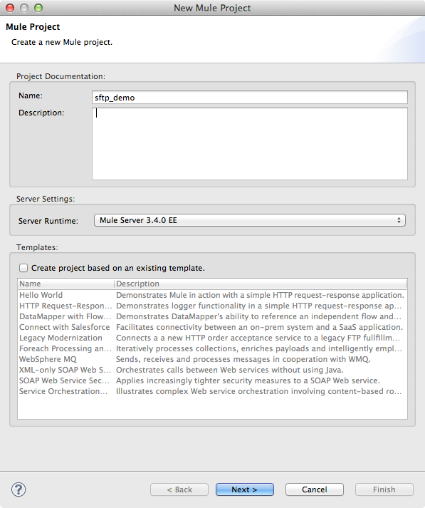
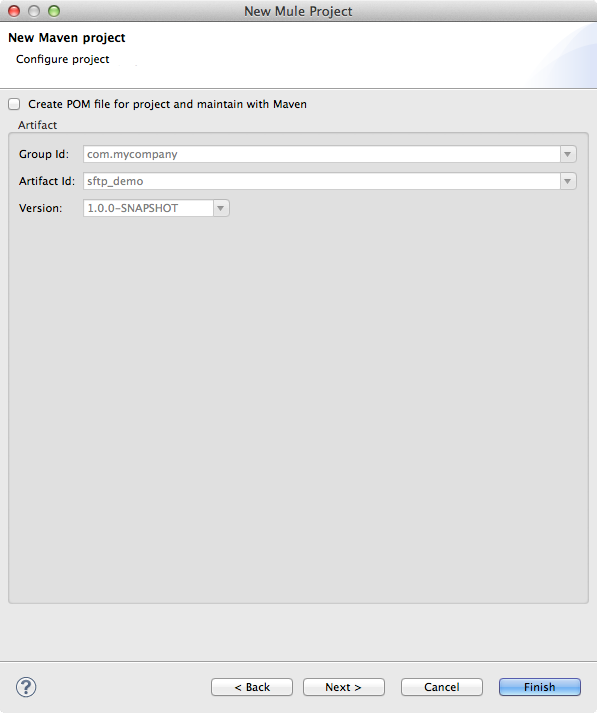
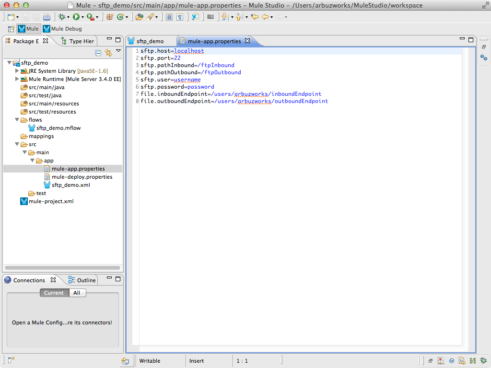
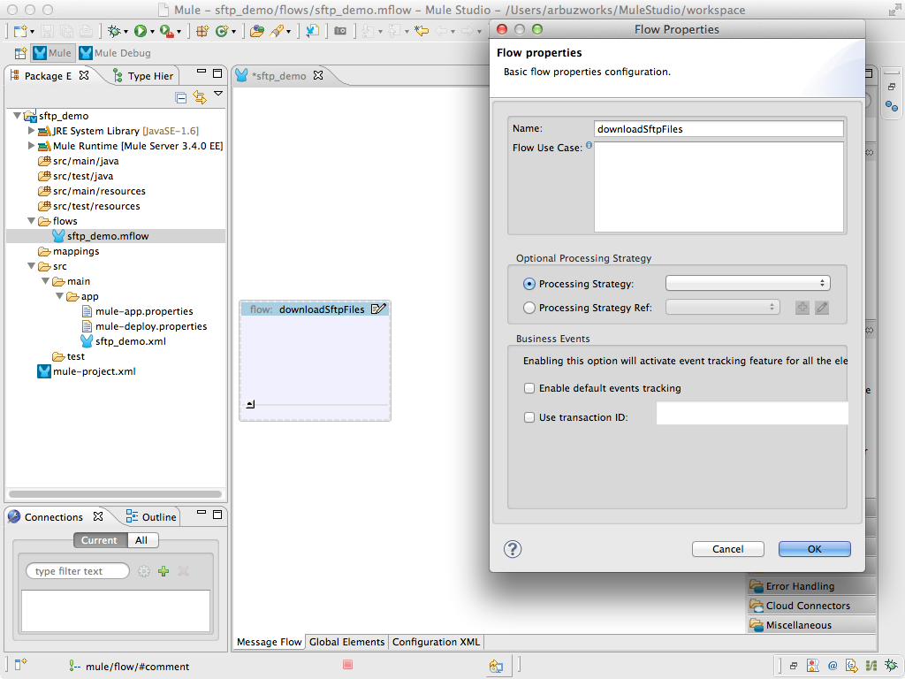
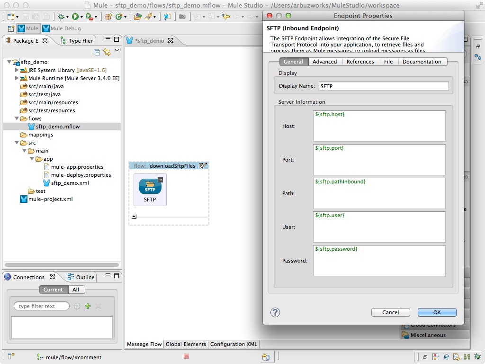
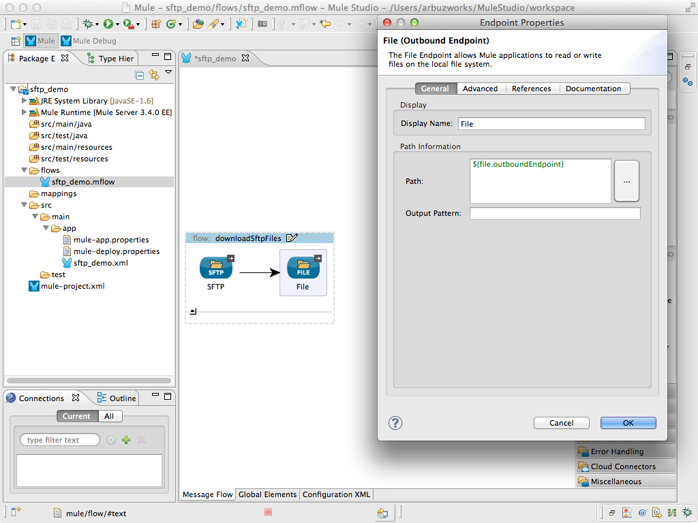
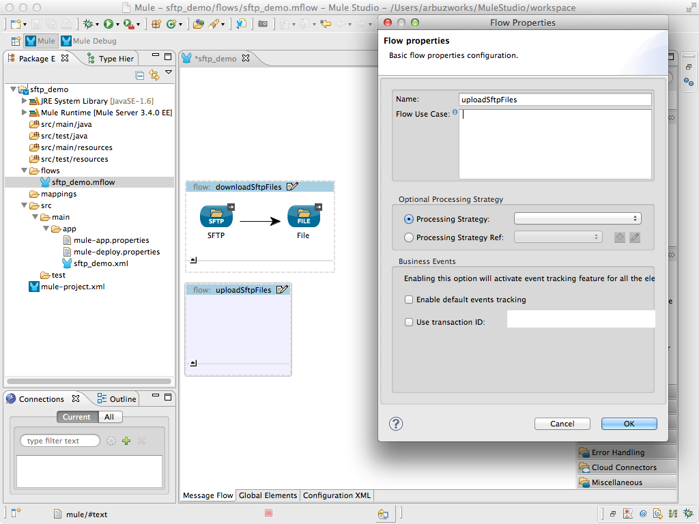
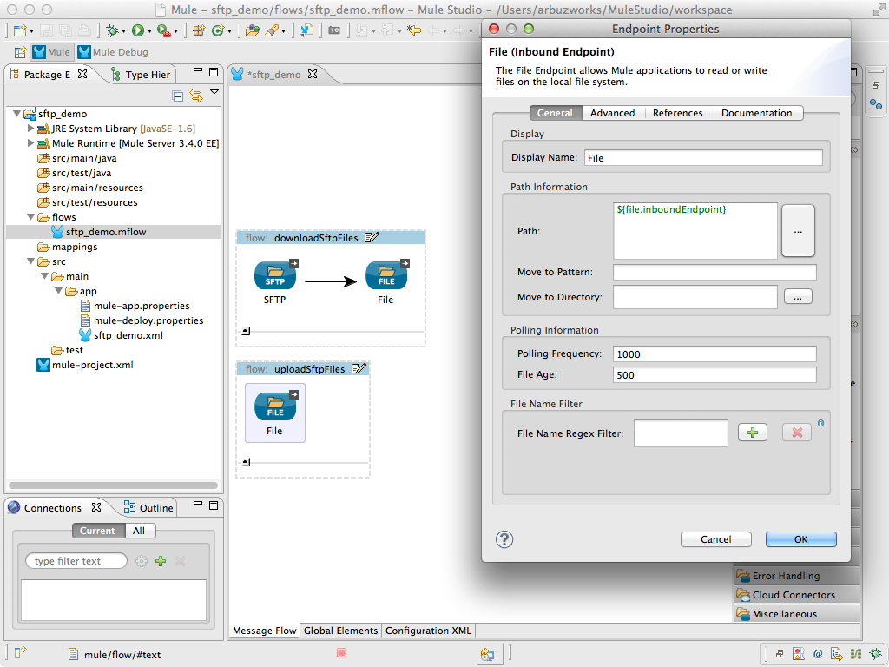
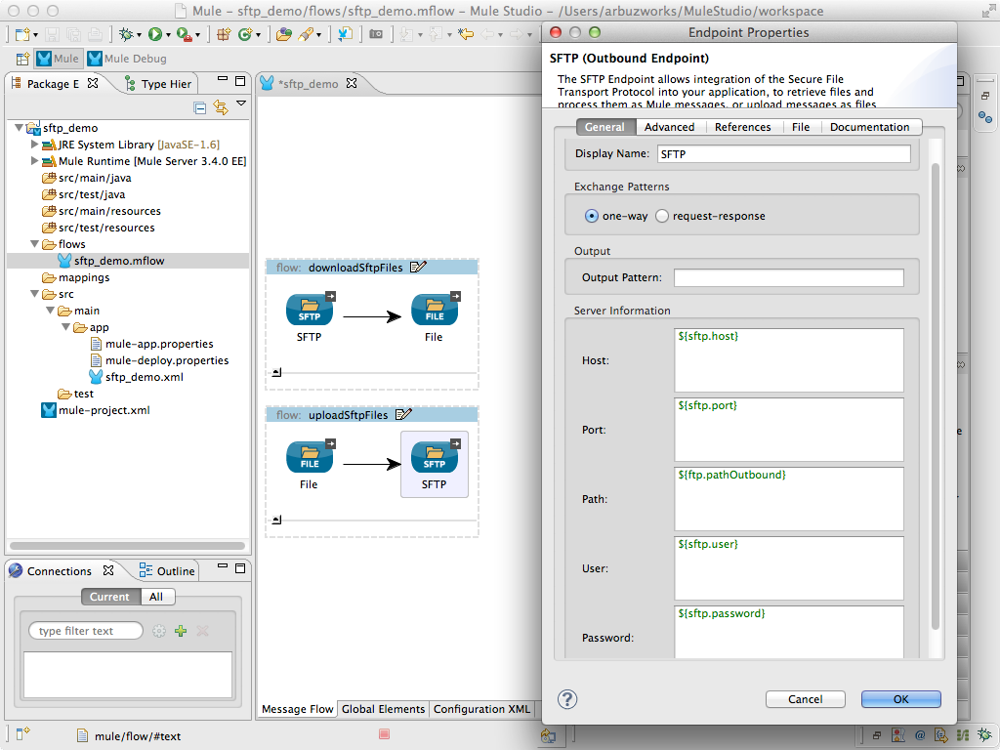

# SFTP Connector

The SFTP Connector allows files to be read and written to and from directories over SFTP. Unlike the VFS Connector, it can handle large files because it streams message payloads. The SFTP connector can be used as an inbound or an outbound endpoint. Files can be retrieved from an SFTP server and processed as Mule messages, or Mule messages can be uploaded as files to an SFTP server.

[Prerequisites](#prerequisites)  
[Step 1: Create Demo Project](#step-1-create-demo-project)  
[Step 2: Configure the application](#step-2-configure-the-application)  
[Step 3: Create Flow for downloading from (S)FTP server to the connected file system](#step-3-create-flow-for-downloading-from-sftp-server-to-the-connected-file-system)  
[Step 4: Run Demo Project](#step-4-run-demo-project)  
[Step 5: Test downloadFtpFiles Flow](#step-5-test-downloadftpfiles-flow)  
[Step 6: Create Flow for uploading files to FTP server](#step-6-create-flow-for-uploading-files-to-ftp-server)  
[Step 7: Test uploadFtpFiles Flow](#step-7-test-uploadftpfiles-flow)  
[XML Flow](#xml-flow)  
[Other Resources](#other-resources)  

### Prerequisites

In order to build and run this project you'll need:

*   [MuleStudio](http://www.mulesoft.org/download-mule-esb-community-edition).
*   Two target directories on the connected file system (your local machine).
    *    **/users/arbuzworks/inboundEndpoint** - a location within the connected file system of the file being transferred into the flow.
    *    **/users/arbuzworks/outboundEndpoint** - a directory on the connected file system to which the file currently in the flow will be written. 

*    An (S)FTP client to connect to a (S)FTP server. You have to know the following parameters to get an access to the (S)FTP server:
    *    **host** - An IP address (such as www.mulesoft.com, localhost, or 192.168.0.1).
    *    **port** - The port number to connect on.
    *    **user** - If (S)FTP is authenticated, this is the username used for authenitcation.
    *    **password** - The password for the user being authenticated.

*    Working (S)FTP server with two required directories with the (S)FTP user access to read and write files.
    *    **localhost:22/ftpInbound** - a directory on the (S)FTP server from which the file will be downloaded to the connected file system.
    *    **localhost:22/ftpOutbound** - a directory on the (S)FTP server to which the file will be uploaded from the connected file system.

    
### Step 1: Create Demo Project

*    Run Mule Studio and select **File \> New \> Mule Project** menu item.  
*    Type **ftp_demo** as a project name and click **Next**.  

*    Then click **Finish**.

### Step 2: Configure the application

We need to provide values for the (S)FTP server and the connected file system parameters. Open **src/main/app/flows/mule-app.properties** file and add the following lines:    
    sftp.host=localhost    
    sftp.port=22    
    sftp.pathInbound=/ftpInbound    
    sftp.pathOutbound=/ftpOutbound    
    sftp.user=username    
    sftp.password=password        
    file.inboundEndpoint=/Users/arbuzworks/inboundEndpoint    
    file.outboundEndpoint=/Users/arbuzworks/outboundEndpoint    

### Step 3: Create Flow for downloading from (S)FTP server to the connected file system
The aim of this Flow is to download files from the (S)FTP server directory **localhost:22/ftpInbound** to the connected file system directory **/users/arbuzworks/outboundEndpoint**.

*    Switch to the **Message Flow** tab in the flow editor.
*    Add a new flow by dragging it from the Palette.
*    Double click the new flow to open its properties and rename it to **downloadSftpFiles**. Click **OK**.

*    Drag **SFTP Endpoint** to the flow. Double click it to show its properties and adjust them as displayed on the following image.

*    Drag **File Endpoint** to the flow. Double click it and set a path to the directory where files will be saved.

*    Save the flow.

### Step 4: Run Demo Project

*    Right Click on **src/main/app/ftp_demo.xml \> Run As/Mule Application**.

 

*    Check the console to see when the application starts.  

You should see a log message on the console:  
 
    ++++++++++++++++++++++++++++++++++++++++++++++++++++++++++++    
    + Started app 'sftp_demo'                                  +
    ++++++++++++++++++++++++++++++++++++++++++++++++++++++++++++
    
### Step 5: Test downloadFtpFiles Flow

*    Open the (S)FTP client and download a file to the (S)FTP server directory **localhost:22/ftpInbound**.    
*    You should see the uploaded file in the connected file system directory **/users/arbuzworks/outboundEndpoint**.    
*    Stop Mule server.   

### Step 6: Create Flow for uploading files to (S)FTP server
The aim of this Flow is to upload files from the connected file system directory **/users/arbuzworks/inboundEndpoint** to the (S)FTP server directory **localhost:22/ftpOutbound**.

*    Switch to the **Message Flow** tab in the flow editor.
*    Add a new flow by dragging it from the Palette.
*    Double click the new flow to open its properties and rename it to **uploadSftpFiles**. Click **OK**.

*    Drag **File Endpoint** to the flow. Double click it and set a path to the directory from which the files will be uploaded to the (S)FTP server.

*    Drag **SFTP Endpoint** to the flow. Double click it to show its properties and adjust them as displayed on the following image.

*    Save the flow.

### Step 7: Test uploadFtpFiles Flow

*    Run Demo Project as it is described on **Step 4**.
*    Paste the file to the local directory **/users/arbuzworks/inboundEndpoint**.
*    Open the (S)FTP client.
*    You should see the new file in the (S)FTP server directory **localhost:22/ftpOutbound**. The file will be removed from  **/users/arbuzworks/inboundEndpoint** automatically.

### XML Flow 

The final XML flow should look like that:

    <?xml version="1.0" encoding="UTF-8"?>

    <mule xmlns:sftp="http://www.mulesoft.org/schema/mule/sftp" xmlns:file="http://www.mulesoft.org/schema/mule/file" xmlns:tracking="http://www.mulesoft.org/schema/mule/ee/tracking" xmlns="http://www.mulesoft.org/schema/mule/core" xmlns:doc="http://www.mulesoft.org/schema/mule/documentation" xmlns:spring="http://www.springframework.org/schema/beans" version="EE-3.4.0" xmlns:xsi="http://www.w3.org/2001/XMLSchema-instance" xsi:schemaLocation="http://www.springframework.org/schema/beans http://www.springframework.org/schema/beans/spring-beans-current.xsd http://www.mulesoft.org/schema/mule/core http://www.mulesoft.org/schema/mule/core/current/mule.xsd http://www.mulesoft.org/schema/mule/sftp http://www.mulesoft.org/schema/mule/sftp/current/mule-sftp.xsd http://www.mulesoft.org/schema/mule/file http://www.mulesoft.org/schema/mule/file/current/mule-file.xsd http://www.mulesoft.org/schema/mule/ee/tracking http://www.mulesoft.org/schema/mule/ee/tracking/current/mule-tracking-ee.xsd">
        <flow name="downloadSftpFiles" doc:name="downloadSftpFiles">
            <sftp:inbound-endpoint host="${sftp.host}" port="${sftp.port}" path="${sftp.pathInbound}" user="${sftp.user}"   password="${sftp.password}" responseTimeout="10000" doc:name="SFTP"/>
            <file:outbound-endpoint path="${file.outboundEndpoint}" responseTimeout="10000" doc:name="File"/>
        </flow>
        <flow name="uploadSftpFiles" doc:name="uploadSftpFiles">
            <file:inbound-endpoint path="${file.inboundEndpoint}" responseTimeout="10000" doc:name="File"/>
            <sftp:outbound-endpoint exchange-pattern="one-way" host="${sftp.host}" port="${sftp.port}" path="${ftp.pathOutbound}" user="${sftp.user}" password="${sftp.password}" responseTimeout="10000" doc:name="SFTP"/>
        </flow>
    </mule>
   
### Other Resources

For more information on:

- Mule AnyPoint® connectors, please visit [http://www.mulesoft.org/connectors](http://www.mulesoft.org/connectors)
- Mule platform and how to build Mule apps, please visit [http://www.mulesoft.org/documentation/display/current/Home](http://www.mulesoft.org/documentation/display/current/Home)
